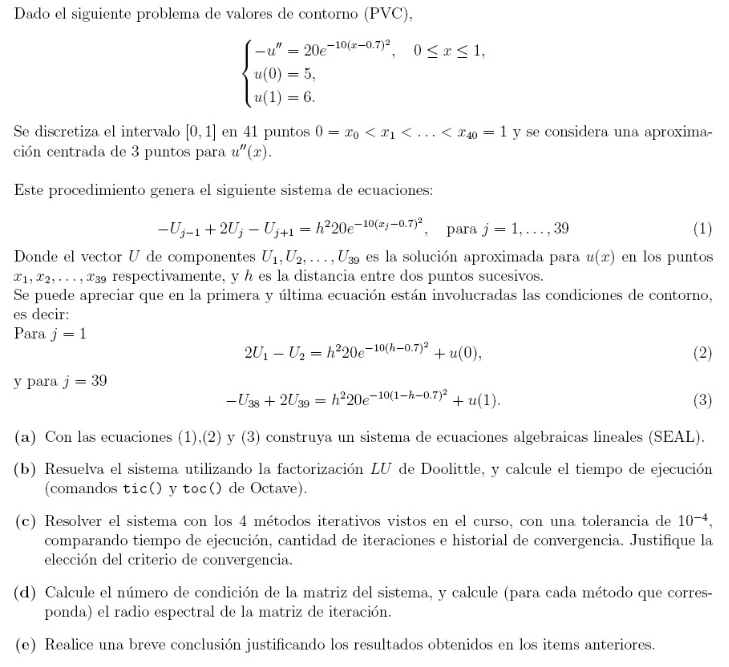
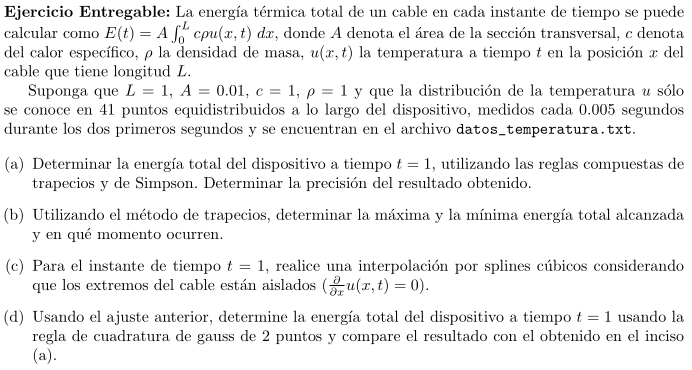
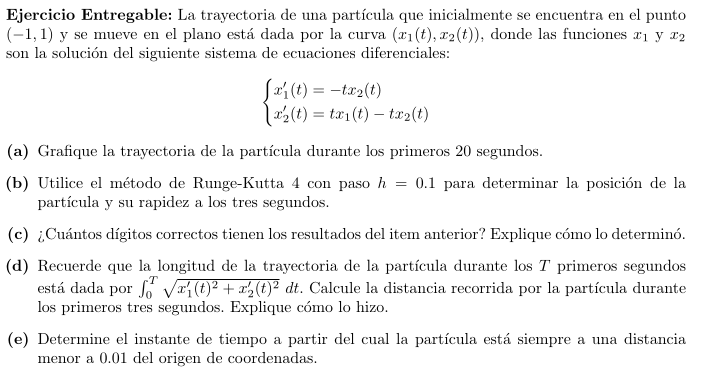

# Metodos Numericos

Funciones y scripts hechos en octave para la realzacion de metodos numericos, vistos en la materia _Calculo Numerico (FICH)_:

- resolucion de SEAL
  - metodos directos
  - metodos iterativos (Gauss-Seidel, SOR, etc)
- resolcion de ecuaciones no lineales (metodo biseccion, newton-raphson, etc)
- metodos de interpolacion y aproximacion
- metodos de derivacion e integracion numerica
- resolucion de problemas de valores iniciales (**PVI**)
- resolucion de problemas con valores de contorno (**PVC**)

---

## Ejercicios entregables

### Entregable 1

### Entregable 3

### Entregable 4

